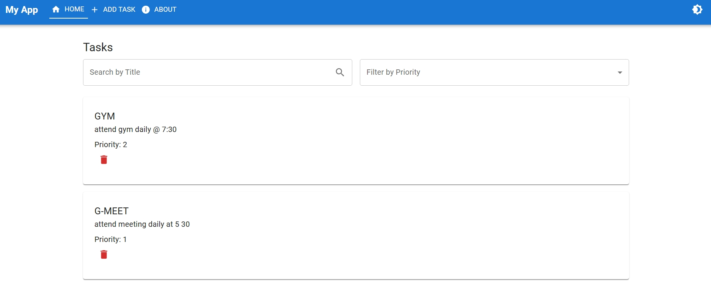
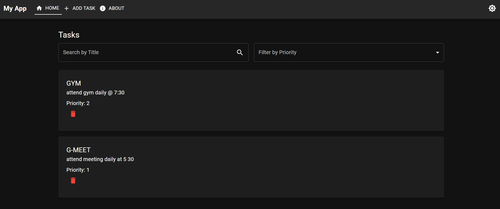
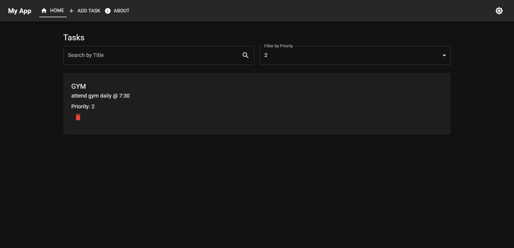
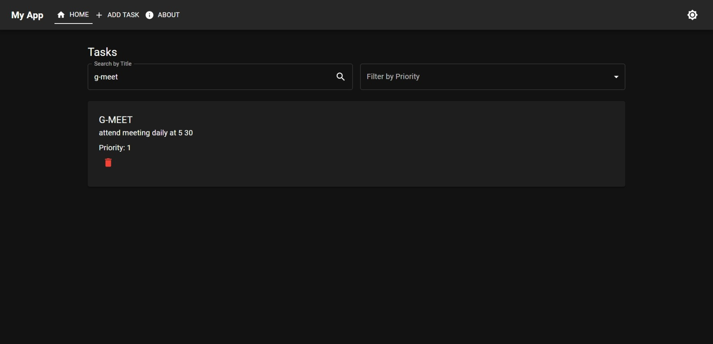

# 📝 Week2 Day1— [Sep29]

## Task
- Scaffold app
- setup basic folder structure 
- Create homepage with MUI Typography and AppBar

## screenshot


## Steps
### 1.Create a React App

```
npx create-react-app karthi-app
cd karthi-app
```

### 2.Install Material UI

```
npm install @mui/material @emotion/react @emotion/styled @mui/icons-material
```
### 3.Setup 2 Folder 
```
  App.js
  index.js
```
### 4.Create a Header Component
```
src/components/Header.js
```
### 5.Create a Homepage
```
src/pages/Homepage.js
```
### 6.src/pages/Homepage.js
```
src/App.js
```
### 7.Run the App
```
npm start
```
# 📝 Week2 Day2

## Task

- TaskCard component 
- render list of dummy tasks via props

## screenshot


### about
- updated the same day-1 code by adding taskcard.jsx

# 📝 Week2 Day3

## Task

- Add ability to add tasks; manage state; 
- fetch effects if needed (dummy), 
- Create form using MUI TextFields and Buttons; 
- validate required inputs / length / number etc.

## screenshot


# 📝 Week2 Day4

## Task

- Add routing: Home, Add Task, About; 
- navigation bar, Save tasks to localStorage;
- load on mount; polish UI; icons; 
- Theming;

## screenshot

### The above images shows light and dark theme with navigation bar 





# 📝 Week2 Day5

## Task

- Add search/filter UI; 
- theme toggle (light/dark) if possible; polish

## screenshot

### i have added search and filter based on priority and title

### search based on priority


### search based on title


 


