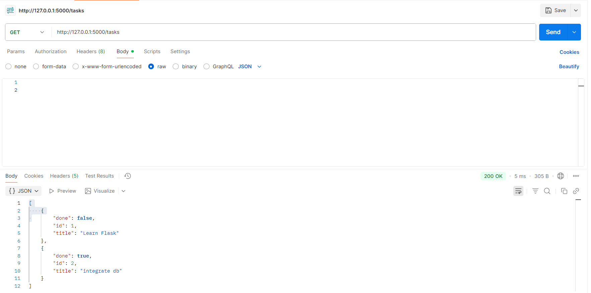
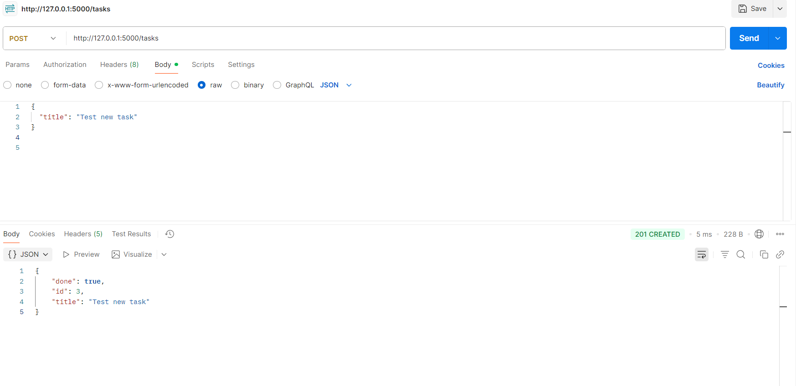
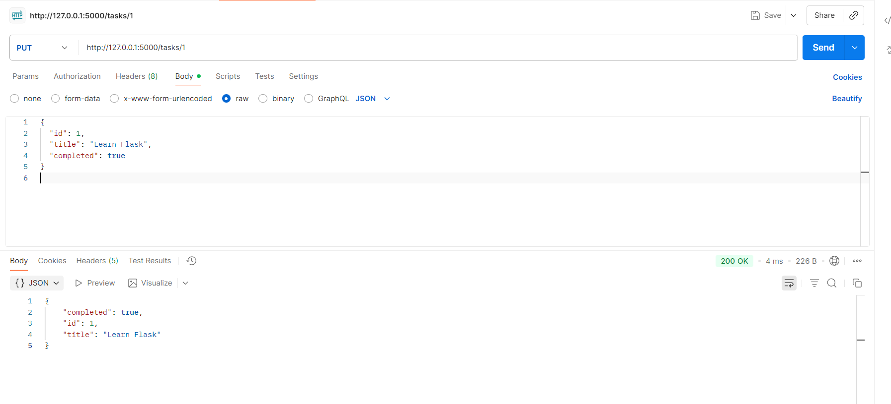
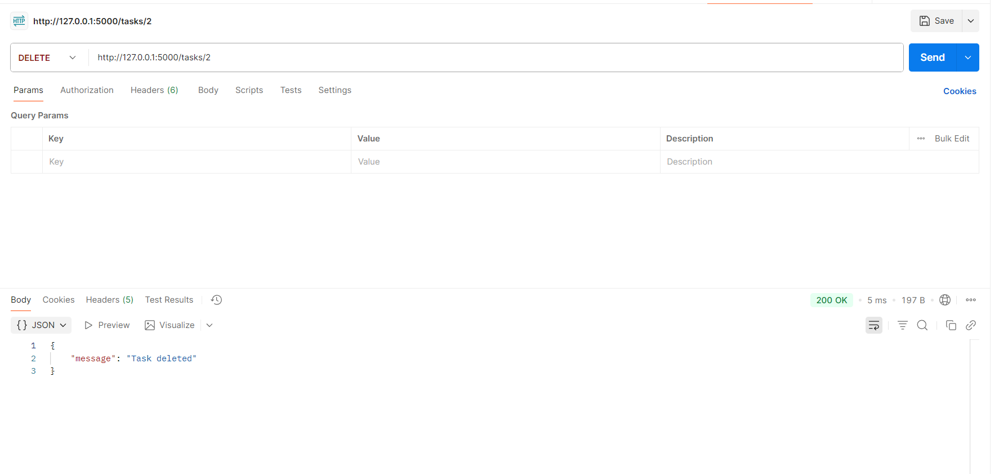

# 📝 Flask Task Manager API

A simple RESTful API built with **Flask** to manage tasks.  
It supports adding, updating, deleting, and filtering tasks by completion status.

---

## 🚀 Features
- Add new tasks  
- View all tasks or filter by completion (`?completed=true/false`)  
- Update existing tasks  
- Delete tasks by ID  

---

## 📌 Endpoints

### **GET /tasks**
Fetch all tasks.

### **POST /tasks**
add all tasks.

### **PUT /tasks**
UPDATE tasks.

### **DELETE /tasks**
Delete tasks.

