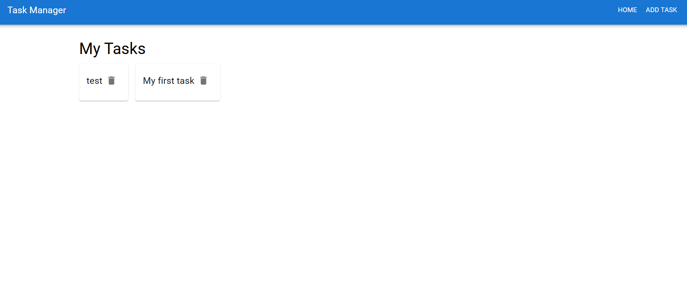
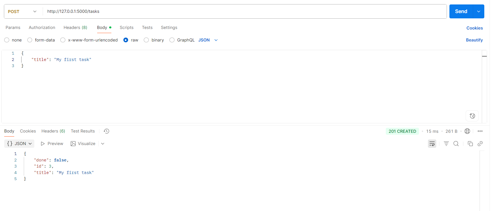
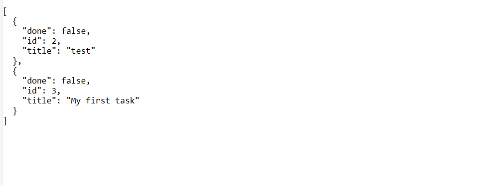

# 📝 Week 3 Day 3 — [Oct 9]

## 🎯 Learning Topics
- Error Handling  
- Input Validation  
- Status Codes  
- CORS (Cross-Origin Resource Sharing)  
- Connecting Flask Backend with React Frontend  
- Testing API Endpoints (Postman / Browser)

---

## 🧩 Task Overview
- Add error handlers (`404`, `400`)  
- Validate inputs (e.g. non-empty strings, valid JSON)  
- Enable **CORS** for frontend communication  
- From **React frontend**, make API calls to Flask backend  
- Test all endpoints using **Postman** and **Browser**

---

## ⚙️ Steps Followed

### 1️⃣ Added Error Handlers in Flask
Handled:
- **404 (Not Found)** → when task doesn’t exist  
- **400 (Bad Request)** → when invalid data or JSON is sent  

```python
@app.errorhandler(404)
def not_found_error(error):
    return jsonify({"error": "Resource not found"}), 404

@app.errorhandler(400)
def bad_request_error(error):
    return jsonify({"error": "Bad request"}), 400
    
```

### Gallery:








