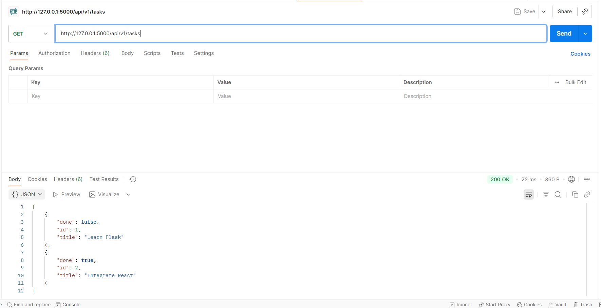
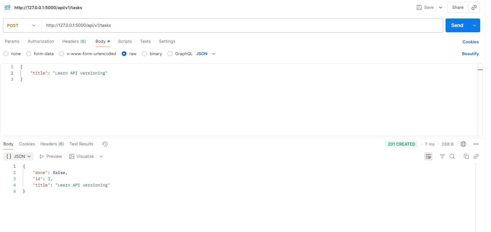
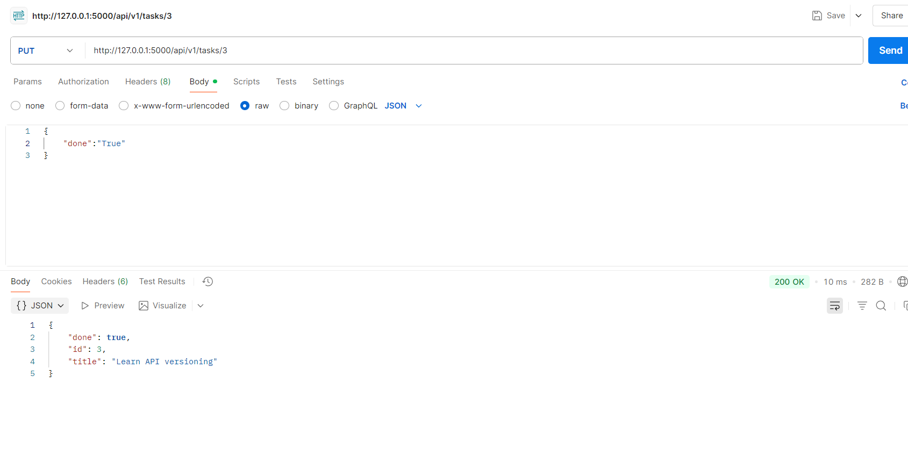
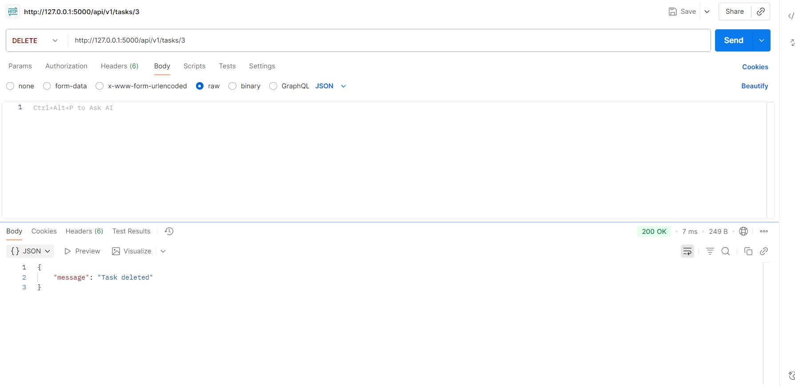

# 🧩 Flask Task Manager API — v1

A RESTful API built using **Flask** to manage tasks (CRUD operations) with **versioning**, **input validation**, **error handling**, and **CORS** enabled for frontend integration.  
This version is **v1** of the API, available under the `/api/v1` path.

---

## 📚 Documentation

### 🏁 Base URL
http://127.0.0.1:5000/api/v1
---

## 🧠 Endpoints Overview

| Method | Endpoint | Description |
|--------|-----------|-------------|
| `GET` | `/tasks` | Get all tasks or filter by completion |
| `POST` | `/tasks` | Create a new task |
| `PUT` | `/tasks/<id>` | Update an existing task |
| `DELETE` | `/tasks/<id>` | Delete a task by ID |

---

### 🔹 **GET /api/v1/tasks**

Retrieve all tasks.

**Query Parameters**
| Name | Type | Description |
|------|------|-------------|
| `completed` | boolean | Filter tasks (`true` or `false`) |

**Example**

### 🔹 ***POST /api/v1/tasks***

Create a new task.

Request Body

{
  "title": "Learn Flask",
  "completed": false
}

Response

{
  "id": 2,
  "title": "Learn Flask",
  "completed": false
}

### 🔹*** PUT /api/v1/tasks/<id>***

Update an existing task.

Example

PUT /api/v1/tasks/2

Request Body

{
  "title": "Learn Flask + React Integration",
  "completed": true
}

Response

{
  "id": 2,
  "title": "Learn Flask + React Integration",
  "completed": true
}

### 🔹*** DELETE /api/v1/tasks/<id>***

Delete a task by ID.

Example

### ***DELETE /api/v1/tasks/2***

Response

{
  "message": "Task deleted successfully"
}

