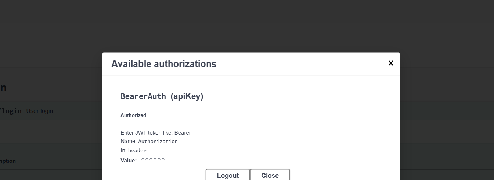
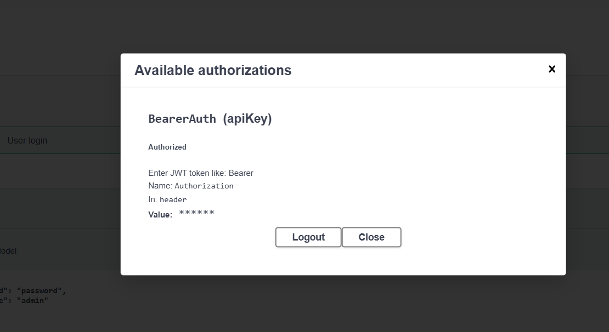
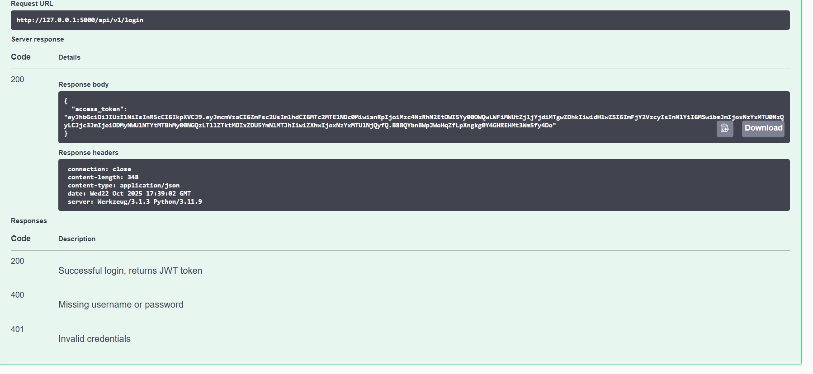

# 🛡️ Flask Task Manager API — v1 (with Authentication, Logging & Testing)

A RESTful API built using **Flask** for managing tasks.  
Includes **token-based authentication**, **logging**, and **unit testing** for better security, maintainability, and reliability.

---

## 🚀 Features
- ✅ Full CRUD operations on tasks  
- 🔍 Filtering via query parameters (`?completed=true/false`)  
- 🔒 Token-based Authentication (Bearer tokens)  
- 🧾 Logging (info, errors, activity tracking)  
- 🧪 Unit Testing with `pytest`  
- ⚙️ Input Validation & Error Handling  
- 🌐 CORS enabled for React frontend integration  
- 🧩 API Versioning (`/api/v1`)

---

## 🏁 Base URL
http://127.0.0.1:5000/api/v1


---

## 🔐 Authentication

### 🔸 Token-Based Authentication
All endpoints are **protected** using a simple token system.

Each request must include an `Authorization` header:


If the token is missing or invalid, the API returns:
```json
{ "error": "Unauthorized access" }

fetch("http://127.0.0.1:5000/api/v1/tasks")


```

### gallery








